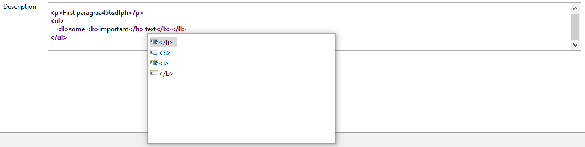

= Xtext / Sirius Integration Readme

This plugin enables https://www.eclipse.org/Xtext/[Xtext] editors to be used as direct editor for https://www.eclipse.org/sirius/[Sirius] diagram elements or Sirius property widgets.

.Direct Editor Example
image:doc/images/eventEditor.png[]

.Property Widget Example

Please refer to the link:doc/userguide.adoc[user guide] for more details.
