= Xtext / Sirius Integration User Guide
Niko Stotz <niko.stotz@altran.com>
:toc:
:toclevels: 5
:miscellaneous.tabsize: 2
:tabsize: 2
:icons: font
:sectnum: 
:sectnums: 
:experimental:
:commandkey: &#8984;
:m1keys: Ctrl]/kbd:[{commandkey}
:source-highlighter: pygments
:prewrap!:
:docinfo2:

This asset enables https://www.eclipse.org/Xtext/[Xtext] editors to be used as direct editor for https://www.eclipse.org/sirius/[Sirius] diagram elements or Sirius property widgets.

This document describes to users (i.e. developers using the Xtext editors in their project) how to work with the Xtext / Sirius integration.

== Terminology

Sirius element::
	Contents of the *.odesign model describing the Sirius application.
	
diagram element::
	Sirius element describing something inside a diagram.
	
property element::
	Sirius element describing something inside the properties view.
	
semantic element::
	EObject of a model the end-user is working with.
	
identifier::
	String entered in the "Id" field of a Sirius element, unique within the Sirius application.
	
direct editor::
	Editor that is displayed inside the diagram if the end-user double-clicks a diagram element or presses kbd:[F2] while the diagram figure is focused.

widget::
	One entry field for a property element inside the properties view.

newline::
	Platform-dependent invisible character(s) denoting the end of one line of text and the start of a new line of text.
	
multi-line::
	Text entry field that shows (potentially) more than one line, and allows the add and remove newlines. Opposite of single-line.
	
single-line::
	Text entry field that shows only one line, and does not allow to add a newline. Opposite of multi-line.
	
injector::
	Google Guice injector completely configured for an Xtext language.
	
feature::
	Instance of Ecore EStructuralFeature describing a part of a semantic element.
	

== Overview
This asset provides extensions to the odesign editor providing Xtext-enabled text entry fields.

Xtext-enabled editors provide the usual Xtext features: syntax highlighting, auto completion, validation, etc.

The Xtext language does not need to be modified to be used in the editor (except for <<specialEditGrammar, fixing an Xtext bug>>).

The text entry fields can be placed 

* either inside a Sirius diagram (direct editors; <<directEdit, directEdit>>)
* or in the Sirius properties view (widgets; <<property, property>>).

The contents of the editors can be retrieved 

* either from a semantic element of a model that's used as input to the diagram (<<model, model>>),
* or from a String feature of a semantic element (<<value, value>>). In this case, we may supply additional information if we wanted to edit an incomplete model:
** text (hidden from the end-user) to be pre-pended (<<prefixText-suffixText, prefixText>>),
** text (hidden from the end-user) to be appended (<<prefixText-suffixText, suffixText>>).

For _model_-based _directEdit_ editors, the contents can be limited to a set of features (<<editableFeatures, editableFeatures>>).
If the model element is an edge, the affected label must be set (<<edgeLabelPosition, edgeLabelPosition>>).

An editor can display

* either single-line contents (<<singleLine-multiLine, singleLine>>),
* or multi-line contents (<<singleLine-multiLine, multiLine>>).

For all editors, we need to provide

* An injector to access the Xtext language to use (<<injector, injector>>).
	

All of this can be summarized in one table:

[options="autowidth"]
|====
|	^.<| *<<property, property>>*	2+^.<| *<<directEdit, directEdit>>*	| *add. info footnoteref:[info]*

.2+.^| *<<model, model>>*	
| <<singleLine-multiLine, image:images/XtextSingleLineModelDescription.gif[] singleLine>>	
| <<singleLine-multiLine, image:images/XtextDirectEditModelDescription.gif[] singleLine>>	
.2+.^| _<<editableFeatures, editableFeatures>>, +
 <<edgeLabelPosition, image:images/XtextEdgeLabelDirectEditModelDescription.gif[] image:images/XtextEdgeLabelDirectEditValueDescription.gif[] edgeLabelPosition>>_	
|
| <<singleLine-multiLine, image:images/XtextMultiLineModelDescription.gif[] multiLine>>	
| <<singleLine-multiLine, image:images/XtextDirectEditModelDescription.gif[] multiLine>> 
|

.2+.^| *<<value, value>>*	
| <<singleLine-multiLine, image:images/XtextSingleLineValueDescription.gif[] singleLine>>	
2+| <<singleLine-multiLine,  singleLine>>	
.2+.^| _<<prefixText-suffixText, prefixText>>, <<prefixText-suffixText, suffixText>>_
| <<singleLine-multiLine, image:images/XtextMultiLineValueDescription.gif[] multiLine>>	
2+| <<singleLine-multiLine,  multiLine>>

| *add. info footnoteref:[info]*	
|  
2+| 	
| *for all:* _<<injector, injector>>_
|====

As an advanced capability, the editor might use a <<specialEditGrammar, different grammar>> (a.k.a. Xtext language) for editing model contents than the one used for serialization.

.Packaging

we provide two different Eclipse features:

* `com.altran.general.integration.xtextsirius.design.feature` contains all Eclipse plug-ins required to edit the Xtext-enabled entry fields in the odesign editor. It also contains the runtime feature below.
* `com.altran.general.integration.xtextsirius.runtime.feature` contains all Eclipse plug-ins required at runtime to use the Xtext-enabled entry fields in a diagram (or associated property view).

== Examples
	
.Screenshot of fowlerdsl.odesign
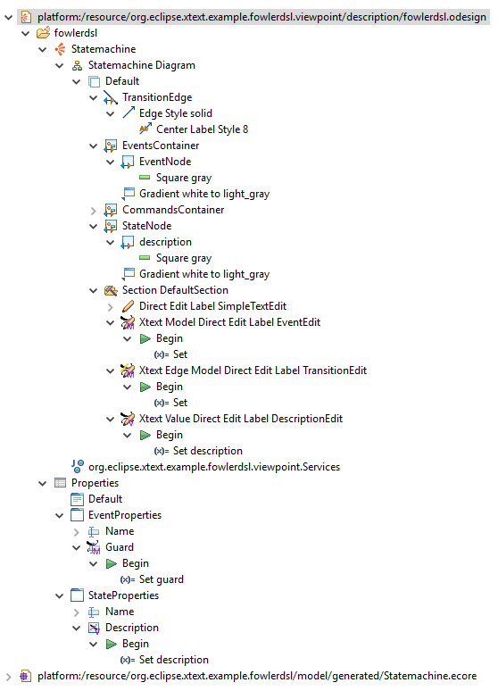

.fowlerdsl.odesign
[source,subs="verbatim,quotes"]
----
platform:/resource/org.eclipse.xtext.example.fowlerdsl.viewpoint/description/fowlerdsl.odesign
	+ fowlerdsl
		+ Statemachine
			+ Statemachine Diagram
				+ Default
					+ *TransitionEdge*                                        <2>
							domainClass=statemachine.Transition
							labelDirectEdit=TransitionEdit
						+ Edge Style solid
							+ *Center Label Style 8*
								labelExpression="ocl:self.event.name.concat( ' as Label')"
					+ EventsContainer
						+ *EventNode*                                           <1>
								domainClass=statemachine.Event
								labelDirectEdit=EventEdit
							+ *Square gray*
								labelExpression="ocl:self.name.concat(if(self.guard.oclIsUndefined()) then '' else ' [' + self.guard.toString() + ']' endif)"
					+ CommandsContainer
					+ StateNode
						+ *description*                                         <3>
								domainClass=statemachine.State
								labelDirectEdit=DescriptionEdit
							+ *square gray*
								labelExpression="ocl:'Desc: '.concat(self.description)"
					+ Section DefaultSection
						+ Direct Edit Label SimpleTextEdit
						+ *Xtext Model Direct Edit Label EventEdit*             <1>
								id=EventEdit
								mapping=EventNode
								inputLabelExpression="var:self"
								injectorId="org.eclipse.xtext.example.fowlerdsl.viewpoint.fowlerdslInjectorId"
								lines=singleLine
							+ Begin
								+ *Set*
									featureName=_«empty»_
									valueExpression="var:newValue"
						+ *Xtext Edge Model Direct Edit Label TransitionEdit*   <2>
								id=TransitionEdit
								mapping=TransitionEdge
								inputLabelExpression="var:self"
								injectorId="org.eclipse.xtext.example.fowlerdsl.viewpoint.inlineEditInjectorId"
								edgeLabelMappings=Center Label Style 8
								lines=singleLine
								editableFeatures=Transition.event, Transition.guard
							+ Begin
								+ *Set*
									featureName=_«empty»_
									valueExpression="var:newValue"
						+ *Xtext Value Direct Edit Label DescriptionEdit*       <3>
								id=DescriptionEdit
								mapping=description
								inputLabelExpression="feature:description"
								injectorId="org.eclipse.xtext.example.fowlerdsl.viewpoint.htmlInjectorId"
								lines=multiLine
								prefixTextExpression="<html><head><title>t</title></head><body>"
								suffixTextExpression="</body></html>"
							+ Begin
								+ *Set description*
									featureName=description
									valueExpression="var:newValue"
			+ org.eclipse.xtext.example.fowlerdsl.viewpoint.Services
		+ Properties
			+ Default
				+ Default
					+ EventProperties
							domainClass=statemachine.Event
						+ Name
						+ *Guard*                                               <4>
								id=EventGuardId
								labelExpression="Guard"
								valueExpression="feature:guard"
								injectorId="org.eclipse.xtext.example.fowlerdsl.viewpoint.fowlerdslInjectorId"
							+ Begin
								+ *Set guard*
									featureName=guard
									valueExpression="var:newValue"
					+ StateProperties
							domainClass=statemachine.State
						+ Name
						+ *Description*                                         <5>
								id=StateDescriptionId
								labelExpression="Description"
								valueExpression="feature:description"
								lineCount=5
								injectorId="org.eclipse.xtext.example.fowlerdsl.viewpoint.htmlInjectorId"
								prefixTextExpression="<html><head><title>t</title></head><body>"
								suffixTextExpression="</body></html>"
							+ Begin
								+ *Set description*
									featureName=description
									valueExpression="var:newValue"
platform:/resource/org.eclipse.xtext.example.fowlerdsl/model/generated/Statemachine.ecore
----

1. Single-line direct editor of all features of _Event_ instance of Sirius element `EventNode` with the injector supplied by `FowlerdslLanguageInjector`. 
Persisted to itself because _EventEdit.Set.featureName_ is empty.
+
.Event Label (note it does not show the code)
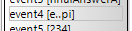
+
.Event Editor
image:images/eventEditor.png[]

2. Single-line direct editor of features `{Transition.event, Transition.guard}` of _Transition_ instance of the `Center Label Style 8` label of Sirius element `TransitionEdge` with the injector supplied by `InlineEditLanguageInjector`.
Persisted to itself because _TransitionEdit.Set.featureName_ is empty.
+
.Transition Label (note it does have additional text at the end)
image:images/transitionLabel.png[]
+
.Transition Editor (note the target of the transition cannot be edited)
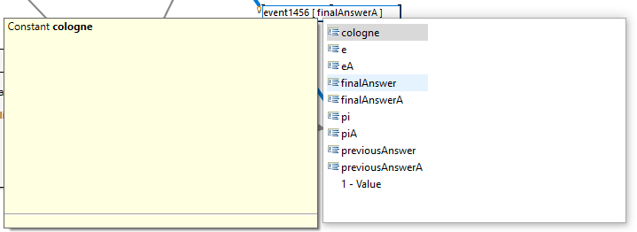

3. Multi-line direct editor of _description_ feature of _State_ instance of Sirius element `description` with the injector supplied by `HtmlLanguageInjector`.
The attribute value will be prefixed by an HTML header and suffixed by an HTML footer.
Persisted to _State.description_ because of _DescriptionEdit.Set.featureName=description_.
+
.Description Label (note it does have additional text at the front)
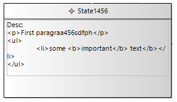
+
.Description Editor
image:images/descriptionEditor.png[]

4. Single-line property editor of _guard_ feature of _Event_ instance of Sirius element `EventGuardId` with the injector supplied by `FowlerdslLanguageInjector`.
Persisted to _Event.guard_ because of _EventGuardId.Set.featureName=guard_.
+
.Event Guard Property Editor
image:images/guardProperty.png[]

5. Multi-line property editor of _description_ feature of _State_ instance of Sirius element `StateDescriptionId` with the injector supplied by `HtmlLanguageInjector`.
The attribute value will be prefixed by an HTML header and suffixed by an HTML footer.
Persisted to _State.description_ because of _StateDescriptionId.Set.featureName=description_.
+
.State Description Property Editor
image:images/descriptionProperty.png[]

.plugin.xml
[source,xml]
----
<extension point="com.altran.general.integration.xtextsirius.runtime.xtextLanguageInjector">
	<injector
		id="org.eclipse.xtext.example.fowlerdsl.viewpoint.fowlerdslInjectorId"
		class="org.eclipse.xtext.example.fowlerdsl.viewpoint.xtextsirius.FowlerdslLanguageInjector"
	/>
	<injector
		id="org.eclipse.xtext.example.fowlerdsl.viewpoint.inlineEditInjectorId"
		class="org.eclipse.xtext.example.fowlerdsl.viewpoint.xtextsirius.InlineEditLanguageInjector"
	/>
	<injector
		id="org.eclipse.xtext.example.fowlerdsl.viewpoint.htmlInjectorId"
		class="org.eclipse.xtext.example.fowlerdsl.viewpoint.xtextsirius.HtmlLanguageInjector"
	/>
</extension>
----

.Properties View of __Xtext Edge Model Direct Edit Label *TransitionEdit* __
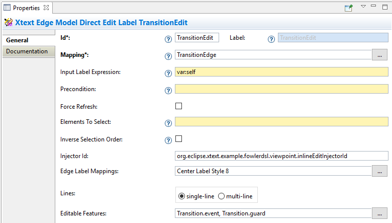

.Properties View of __Xtext Value Direct Edit Label *DescriptionEdit* __
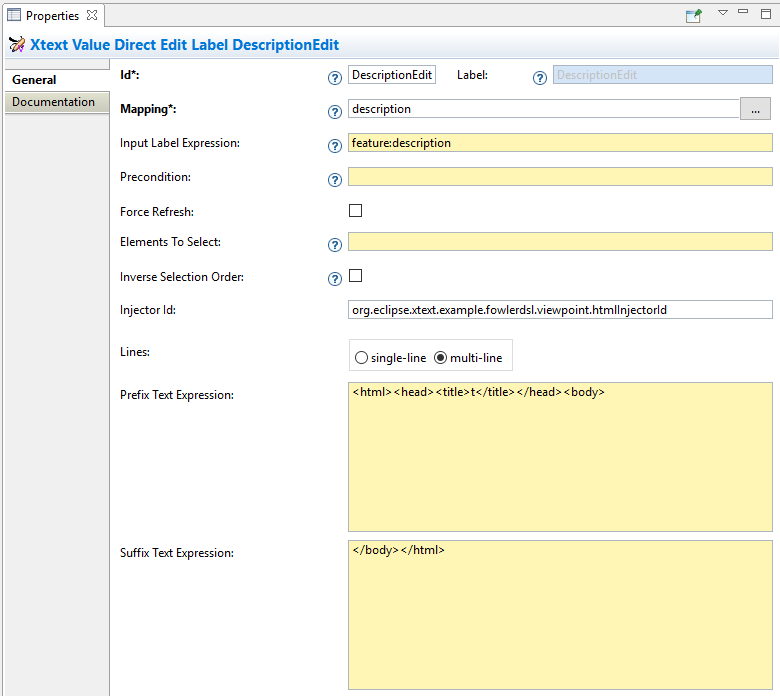

.Properties View of __Xtext Model Text *EventGuardId* __
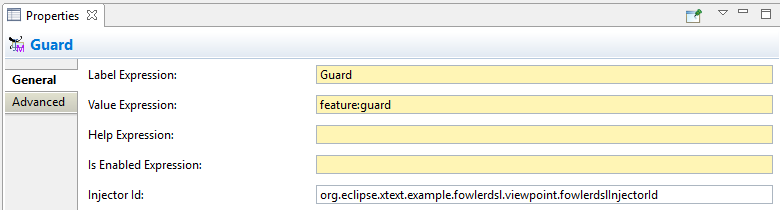

.Properties View of __Xtext Value Text Area *StateDescriptionId* __
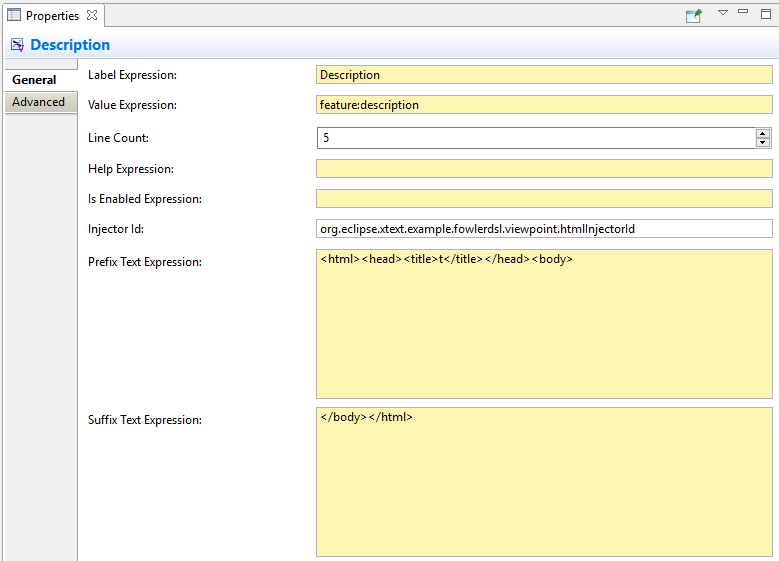

== Reference

=== Editor Placement

[[directEdit]]
==== Diagram / Direct Editor

A direct editor is activated by

* double-clicking on the diagram element,
* pressing kbd:[F2] while the diagram element is focused,
* or starting to type while the diagram element is focused.

The editor replaces the label and is sized to fit its contents.

For single-line editors, the editor closes on pressing kbd:[Enter].

Editor contents are committed to the model when the editor is closed.
The editor closes when it loses focus, e.g. by a click outside the editor.

.Design

Direct editors are specified as tool in the odesign editor.
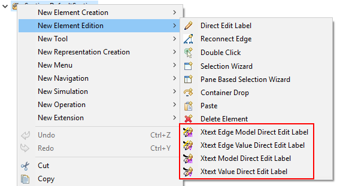

We provide the following variants:

* image:images/XtextEdgeLabelDirectEditModelDescription.gif[] Edge Label Direct Editor for Model content
* image:images/XtextEdgeLabelDirectEditValueDescription.gif[] Edge Label Direct Editor for Value content
* image:images/XtextDirectEditModelDescription.gif[] Direct Editor for Model content
*  Direct Editor for Value content

They can be added to the tools section the same as a regular _Direct Edit Label_ tool.
Accordingly, they need to be selected as _Label Direct Edit_ on the _Behavior_ page of the edited Sirius element.

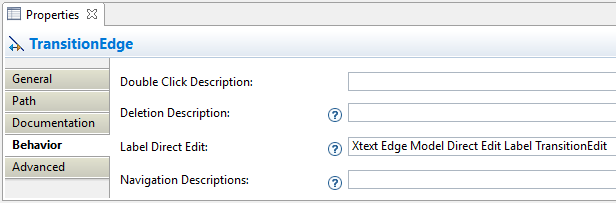

The label is independent of the edited text, i.e. the label can show a different text than the direct editor.

If the set value operation feature is empty, it is interpreted as to replace _var:self_.

.Capabilities

Direct editors 

* can contain <<model, model>> or <<value, value>> contents, 
* may display as <<singleLine-multiLine, single-line>> or <<singleLine-multiLine, multi-line>> editor, 
* and require an <<injector, injector>>.

If the editor contains model contents, it supports to limit the <<editableFeatures, editable features>>.
If the Sirius element is an edge, the editor requires to select an <<edgeLabelPosition, edgeLabelPosition>>.

[[property]]
==== Property View / Property Editor

The Eclipse Properties View contains the property editors.

Editor contents are committed when the editor is hidden.
This happens when the end-user selects a different property page or a different diagram element.

.Design

Property editors are specified as property widgets in the odesign editor.
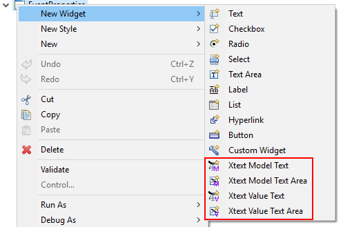

We provide the following variants:

* image:images/XtextSingleLineModelDescription.gif[] Text (aka single-line) Widget for Model content
* image:images/XtextMultiLineModelDescription.gif[] Text Area (aka multi-line) Widget for Model content
* image:images/XtextSingleLineValueDescription.gif[] Text (aka single-line) Widget for Value content
* image:images/XtextMultiLineValueDescription.gif[] Text Area (aka multi-line) Widget for Value content

They can be added as a widget to a Properties Sirius element the same as regular widgets.

.Capabilities

Property editors

* can contain <<model, model>> or <<value, value>> contents, 
* may display as <<singleLine-multiLine, single-line>> or <<singleLine-multiLine, multi-line>> editor, 
* and require an <<injector, injector>>.

=== Editor Contents

[[model]]
==== Editing Models

The editor can contain semantic elements from the same model the edited diagram is based on.

A typical use-case may allow the end-user to edit several features of a semantic element in-line with complete Xtext support.

.Example

As an example, think of a UML class attribute displayed as `+ age: int = 0`.
If the end-user opens the direct editor of the attribute, they can change all these features (visibility, name, type, default value) with complete Xtext support, e.g.

* Proposing all possible visibilities
* Validating the name (e.g. do not allow spaces)
* Proposing and checking the available types
* Allow no, a literal, or a referenced default value

.Details

The editor assumes the model of the edited diagram is persisted with the same Xtext grammar as supplied to the editor (except for <<specialEditGrammar, explicit differences>>).

Any changes in the editor are applied to the underlying model of the edited diagram.
The changes are committed to the Sirius edit session, but only persisted if and when the edited diagram is saved.

The editor maintains references between the edited semantic element (and its descendants) and the rest of the model in both directions, if possible.
The editor does not prevent the end-user from breaking references, e.g. by changed referenced names or deleting referenced elements.

In order to provide appropriate auto-completion and other Xtext features, the editor maintains a complete copy of the edited diagram's model.
However, only the subsection relevant to the selected semantic element (and limited by the <<editableFeatures, editable features>>, if applicable) is shown to, and editable by, the end-user.

Determining the correct subsection is quite complicated, especially if the subsection borders in grammar terminals or contains unset features.
This may lead to incorrectly selected subsections. However, the result should only be affected by the grammar, therefore the developer can test this during development.

The editor reintegrates its contents into the edited diagram's model on model level, not on text level.
This means if the end-user modified any part of the model not contained within the edited semantic element, these changes are not committed.

.Available implementations

* <<directEdit, image:images/XtextEdgeLabelDirectEditModelDescription.gif[] Edge Label Direct Editor for Model content>>
* <<directEdit, image:images/XtextDirectEditModelDescription.gif[] Direct Editor for Model content>>
* <<property, image:images/XtextSingleLineModelDescription.gif[] Text (aka single-line) Widget for Model content>>
* <<property, image:images/XtextMultiLineModelDescription.gif[] Text Area (aka multi-line) Widget for Model content>>

[[value]]
==== Editing Values

The editor can interpret simple String feature of semantic elements as Xtext models.

A typical use-case may allow the end-user to edit the description feature of a semantic element as markup text with complete Xtext support.

.Example

As an example, think of an entity model containing classes that may have descriptions. By its metamodel, the description is merely a String.
An Xtext value editor (primed with an Xtext implementation of HTML) for the description allows the end-user to describe the class with complete Xtext support for HTML.

.Details

Any changes in the editor are stored in the semantic element's String feature as-is.
The changes are committed to the Sirius edit session, but only persisted if and when the edited diagram is saved.

.Available implementations

* <<directEdit, image:images/XtextEdgeLabelDirectEditValueDescription.gif[] Edge Label Direct Editor for Value content>>
* <<directEdit,  Direct Editor for Value content>>
* <<property, image:images/XtextSingleLineValueDescription.gif[] Text (aka single-line) Widget for Value content>>
* <<property, image:images/XtextMultiLineValueDescription.gif[] Text Area (aka multi-line) Widget for Value content>>

[[prefixText-suffixText]]
===== PrefixText and SuffixText

In order to provide appropriate auto-completion and other Xtext features, the editor requires a complete model.
However, the String feature may contain only a subsection of a complete model.
Therefore, the developer may provide text that should be pre-pended and appended to the String feature's value in order to complete the model.
The end-user still sees and edits only the String feature's value.

.Example

Think of a simplified version of HTML implemented as Xtext language. A complete model might look like this:

[source, html]
----
<html>
<head>
	<title>This is a test</title>
</head>
<body>
	
Some paragraph

	<ul>
		<li>This is <b>important</b></li>
		<li>And something's <i>useful</i></li>
	</ul>
	
Some other not so <i>very interesting,</i> but yet <b>highlighted</b> paragraph

</body>
</html>
----

This language should be used for the description feature of classes in an entity model.

However, the model may contain several such classes, and the description of all of them should end up in only one HTML file (in a later generation step).
Instead of storing a complete model into every class' description (and bothering the end-user with it), the description contains only the following part:

[source, html]
----
	
Some paragraph

	<ul>
		<li>This is <b>important</b></li>
		<li>And something's <i>useful</i></li>
	</ul>
	
Some other not so <i>very interesting,</i> but yet <b>highlighted</b> paragraph

----

In order to complete the model for Xtext, the developer supplies the editor with

prefixTextExpression::
	`<html><head><title>Title</title><head><body>`
suffixTextExpression::
	`ocl:'</body>'.concat('</html>')` +
	(the expression does not make sense really, it's only to show we actually _can_ use expressions.)

This way, Xtext works on a complete model, but only the relevant parts are available to the end-user.

We provide these infos via the `prefixTextExpression` / `suffixTextExpression` properties.
As hinted by the name, these fields accept both a simple string as well as any expression supported by Sirius.

=== Editor Infos footnoteref:[info,	These are actually properties of the editor -- but this term is already used a lot.]

[[injector]]
==== Injector

An injector describes a complete Xtext configuration for a language.

In order to avoid class loading issues, we provide injectors via Eclipse extension point `com.altran.general.integration.xtextsirius.runtime.xtextLanguageInjector`.

.xtextLanguageInjector.exsd (in digestible form)
[source, xml]
----
<extension point="com.altran.general.integration.xtextsirius.runtime.xtextLanguageInjector">
  <!-- [0..*] injectors -->
  <injector
    id="«unique id of this injector to be referenced from odesign model»"
    class="«fully qualified name of instance of com.altran.general.integration.xtextsirius.runtime.xtextLanguageInjector»"
  />
</extension>
----

For each injector, we need to define an `id` (to be referenced from the odesign model) and a `class` that implements `com.altran.general.integration.xtextsirius.runtime.IXtextLanguageInjector`.

.IXtextLanguageInjector.java
[source, java]
----
package com.altran.general.integration.xtextsirius.runtime;

import com.google.inject.Injector;

public interface IXtextLanguageInjector {
	public static final String EXTENSION_POINT_ID = "com.altran.general.integration.xtextsirius.runtime.xtextLanguageInjector";
	
	public Injector getInjector();
	
}
----

We refer to the id via the `InjectorId` property.

[[singleLine-multiLine]]
==== Single-line vs. Multi-line

The editor can display one single line or several lines.

Effects for single-line editors:

* All newline characters from the original content are replaced by the same amount of spaces.
* It is not possible to enter a newline.
* kbd:[Enter] closes the direct editor.

For _direct editors_, we define this info via the `Lines` property.
It will adjust its size automatically.

For _property editors_, we define this info by selecting the appropriate widget.
For _Text Area_ widgets, we can define the number of lines to be shown via the `Line Count` property.

.Available *single-line* implementations

* <<directEdit, image:images/XtextEdgeLabelDirectEditModelDescription.gif[] Edge Label Direct Editor for Model content>>
* <<directEdit, image:images/XtextEdgeLabelDirectEditValueDescription.gif[] Edge Label Direct Editor for Value content>>
* <<directEdit, image:images/XtextDirectEditModelDescription.gif[] Direct Editor for Model content>>
* <<directEdit,  Direct Editor for Value content>>
* <<property, image:images/XtextSingleLineModelDescription.gif[] Text (aka single-line) Widget for Model content>>
* <<property, image:images/XtextSingleLineValueDescription.gif[] Text (aka single-line) Widget for Value content>>

.Available *multi-line* implementations

* <<directEdit, image:images/XtextEdgeLabelDirectEditModelDescription.gif[] Edge Label Direct Editor for Model content>>
* <<directEdit, image:images/XtextEdgeLabelDirectEditValueDescription.gif[] Edge Label Direct Editor for Value content>>
* <<directEdit, image:images/XtextDirectEditModelDescription.gif[] Direct Editor for Model content>>
* <<directEdit,  Direct Editor for Value content>>
* <<property, image:images/XtextMultiLineValueDescription.gif[] Text Area (aka multi-line) Widget for Value content>>
* <<property, image:images/XtextMultiLineModelDescription.gif[] Text Area (aka multi-line) Widget for Model content>>

[[editableFeatures]]
==== Editable Features

The editor can limit which features of a semantic element are editable by the end-user.

A typical use-case hides the feature defining the source and/or target of an edge from being edited textually.

.Example

Assume the following Xtext grammar snippet defining an UML-like Association, to be displayed as edge:

[source, antlr]
----
Association:
	name=ID
	code=INT?
	('[' guard=Guard ']')?
	source=[Class] '-->' target=[Class]
;
----

Example model:
----
	driver 23 Car --> Person
----

The label would show `driver 23`.

The end-user should not be able to change the source and/or target of the association, but use an Xtext editor for the label to edit the other features.

Therefore, the developer supplies the following list of `editableFeatures`:

* `Association.name`
* `Association.code`
* `Association.guard`

.Limitations

Limiting the editable features works by finding the first and last of the features in the text stream, and limit the editable area of the model to this subpart.

Therefore, if the model looks like
----
	driver 23 [someCondition] Car --> Person
----

and the `editableFeatures` are limited to

* `Association.name`
* `Association.guard`

the editor would _still_ include the `code` subpart, because it's in between the `name` and `guard` subpart.
----
	driver 23 [someCondition]
----

.Design

The `Editable Features` property contains a read-only list of features.
Edit it by activating the btn:[...] button.
This opens a pop-up window listing all available and currently selected features.

.Available implementations

* <<directEdit, image:images/XtextEdgeLabelDirectEditModelDescription.gif[] Edge Label Direct Editor for Model content>>
* <<directEdit, image:images/XtextDirectEditModelDescription.gif[] Direct Editor for Model content>>

[[edgeLabelPosition]]
==== Position of Affected Edge Label

Unfortunately, we cannot assign different _Direct Edit Label_ tools to different edge labels (`begin`, `center`, `end`).

Therefore, if the developer attaches a direct editor to an edge, the developer needs to specify which edge label should be equipped with Xtext powers.
This info is contained in the `Edge Label Mappings` property.
The read-only list is edited by activating the btn:[...] button.
This opens a pop-up window listing all available and currently selected edge labels.

.Available implementations

* <<directEdit, image:images/XtextEdgeLabelDirectEditModelDescription.gif[] Edge Label Direct Editor for Model content>>
* <<directEdit, image:images/XtextEdgeLabelDirectEditValueDescription.gif[] Edge Label Direct Editor for Value content>>

[[specialEditGrammar]]
== Using a Different Grammar for Editing Model Contents

For editing model contents, we might use a grammar that differs from the one used for model serialization.

A typical use-case may allow to change the order of features in order to allow only a subset of them to be modified.

.Example

As an example, assume the following Xtext grammar snippet:
[source, antlr]
----
grammar org.eclipse.xtext.example.fowlerdsl.Statemachine with org.eclipse.xtext.common.Terminals

generate statemachine "http://www.eclipse.org/xtext/example/fowlerdsl/Statemachine"

Statemachine :
     {Statemachine}
	('events' 
		events+=Event+ 
	'end')?

	// ...
;

Event:
	name=ID code=INT? ('[' guard=Guard ']')?
;

// ...

----

In our editor, we want the end-user to edit only the `name` and `guard` features of `Event`. This is not possible with the given grammar, as `code` is placed between them.

To solve this, we create a new language:
[source, antlr]
----
grammar org.eclipse.xtext.example.fowlerdsl.InlineEdit with org.eclipse.xtext.example.fowlerdsl.Statemachine

import "http://www.eclipse.org/xtext/example/fowlerdsl/Statemachine" 
import "http://www.eclipse.org/emf/2002/Ecore" as ecore

InlineStatemachine returns Statemachine:   <1>
	Statemachine
;

//@Override                                <2>
Event:
	name=ID ('[' guard=Guard ']')? code=INT?
;

----
<1> We have to have a root rule, because Xtext uses the first rule as entry rule. We just forward to the original root rule.
<2> Newer Xtext version know the `@Override` annotation to redefine a rule.

This creates a grammar (for the identical metamodel) that serializes features `name` and `guard` adjacent to each other, so we can limit the editor to them.

.Details

The editing grammar must fulfill the following criteria:

* based on identical metamodel
* has same root element
* contains rules for all semantic elements also covered by the original grammar (either inherited or self-implemented)
* must serialize correctly from a model without any previous textual representation

.Fixing serialization issues

If you experience serialization issues, namely keywords get merged resulting in invalid syntax, you can use a workaround provided by `com.altran.general.integration.xtextsirius.runtime` plug-in.

Typical symptoms of this issue include invalid auto-completion suggestions in the editor and exceptions on committing the changed elements.

To fix this, register the following classes to the editing language:

[source, java]
----
public class InlineEditRuntimeModule extends org.eclipse.xtext.example.fowlerdsl.AbstractInlineEditRuntimeModule {

	public Class<? extends IHiddenTokenSequencer> bindIHiddenTokenSequencer() {
		return com.altran.general.integration.xtextsirius.serializer.ForceWhitespaceBetweenKeywordsHiddenTokenSequencer.class;
	}

	public Class<? extends TextRegionAccessBuilder> bindTextRegionAccessBuilder() {
		return com.altran.general.integration.xtextsirius.serializer.ForceWhitespaceBetweenKeywordsTextRegionAccessBuilder.class;
	}
	
}
----

== Versions

This asset was developed using the following features and versions.

[horizontal]

Eclipse:: 4.5.2 (Mars SR2)
Google Guava:: 21.0
Apache Commons:: 2.6
Eclipse Xcore:: 1.2.1
Eclipse Xtext:: 2.9.2
Eclipse Sirius:: 4.1.6
Yakindu Statecharts Xtext Support:: 3.1.0

== Known Issues

* Determining the correct subsection for <<model, model content>> is not always possible.
* Validation errors (especially syntax errors) are not handled.
